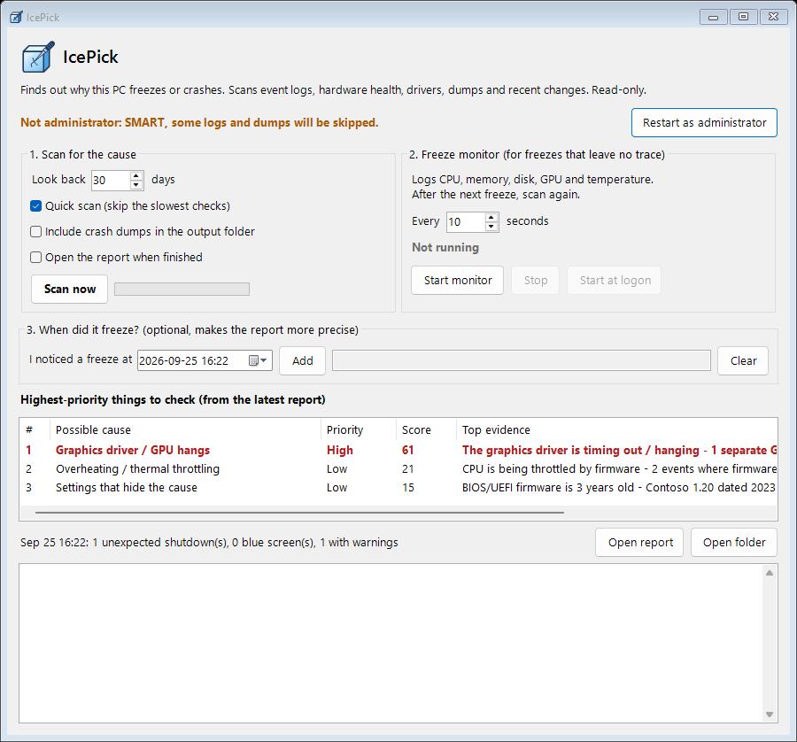
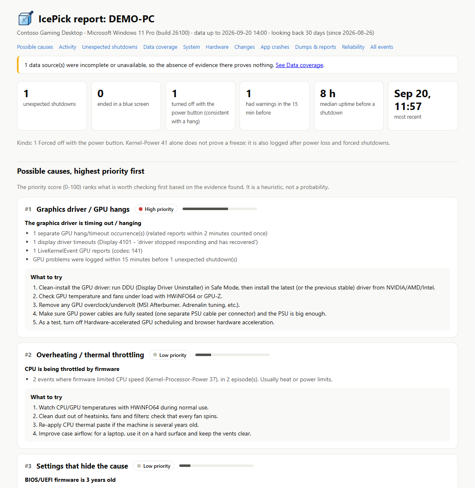

<p align="center">
  
</p>

<p align="center">
  <strong>Find out why your Windows PC freezes, hangs or crashes.</strong><br>
  A portable, read-only diagnostic tool. Nothing to install: download it, double-click, get a report.
</p>

<p align="center">
  
  
  
  
  
</p>

---

Hard freezes are the worst kind of PC problem. The screen locks, you hold the power button, and Windows comes back with no blue screen and no explanation. The clues are still there, but they're spread across a dozen event logs, crash dumps, driver installs and hardware counters.

**IcePick** collects them all, works out when each freeze happened, checks what went wrong in the minutes before, and ranks what to check first in a clear HTML report.

<p align="center">
  
</p>

## Features

- **Reconstructs every unexpected shutdown.** It works out the last moment the PC was known to be alive and when it rebooted, with a timing confidence for each shutdown. It tells a blue screen apart from a forced power-off or a sudden reset.
- **Correlates the minutes before each freeze.** GPU driver timeouts, hardware (WHEA) errors, disk and controller resets, memory exhaustion and thermal throttling logged just before a freeze are linked to it.
- **Ranks possible causes, with next steps.** Each cause lists its evidence and what to try, such as a clean GPU driver install, MemTest86, SSD firmware or BIOS settings.
- **Freeze monitor** for lockups that leave nothing in the logs. It records CPU, memory, disk, GPU and temperature every few seconds, and writes straight to disk so the last readings survive a hard reset.
- **"I noticed a freeze at…"** lets you enter the time a freeze happened, so the report looks at exactly that moment.
- **Honest about gaps.** A Data coverage section shows what couldn't be read, so "nothing found" is never mistaken for "no problem".
- **Portable and shareable.** Every scan saves its full evidence, so the report can be rebuilt on another machine (`-ReplayFrom`), for example by whoever is helping you.

## Quick start

1. **Download** the [latest ZIP](https://github.com/Dan5672/IcePick/archive/refs/heads/main.zip) and copy it to the PC that freezes (a USB stick works).
   Before extracting, right-click the ZIP, choose **Properties**, tick **Unblock** and click **OK**. Otherwise Windows may warn about files downloaded from the internet.
2. Extract it and double-click **`IcePick.cmd`**, then accept the administrator prompt. Administrator access lets IcePick read SMART data, protected logs and crash dumps.
3. Optional: if you know roughly when it froze, enter the time under **When did it freeze?** and click **Add**.
4. Click **Scan now**. The report opens in your browser, usually in under 2 minutes.

**If the report says the freezes left no trace** (common with hard lockups):

5. Click **Start monitor**, or **Start at logon** to keep it running across reboots.
6. Use the PC normally until it freezes again. Then reboot and click **Scan now**. The report shows the last CPU, memory, disk, GPU and temperature readings before the freeze.

## The report

<p align="center">
  
</p>

How to read it:

- **Unexpected shutdowns** are listed by kind: blue screen, forced off with the power button (consistent with a hang), sudden reset or power loss, or a hang you reported. Kernel-Power 41 on its own does not prove a freeze.
- **Timing confidence.** Windows can't record the moment a PC freezes, so the report shows the last known alive time and the reboot time. The gap between them sets the confidence: High up to 5 minutes, Medium up to 60 minutes, otherwise Low. Only High and Medium shutdowns count towards "logged within 15 minutes before" links.
- **The priority score** (0–100) ranks what to check first. It's a heuristic, not a probability.
- **Data coverage** lists sources that were truncated, unavailable or skipped.

## What it checks

| Area | Sources |
|---|---|
| Unexpected shutdowns | Kernel-Power 41 (bugcheck code, power button, WHEA boot errors), EventLog 6008, BugCheck 1001, boot sessions |
| Hardware errors | WHEA-Logger (fatal 1/18/20/46, corrected 19/47, PCIe 17) |
| GPU hangs | Display 4101 TDRs, NVIDIA/AMD/Intel driver events, GPU-class LiveKernelReports, WER LiveKernelEvents |
| Storage | disk / stornvme / storahci / Ntfs errors, SMART and reliability counters, free space |
| Memory | Memory Diagnostic results (by event ID, any language), low-memory events, XMP/mixed-module hints |
| Thermal | Firmware CPU throttling, ACPI thermal zones (often not available on desktops) |
| Blue screens | Stop codes; minidumps from the configured dump folder, analysed automatically if the Windows SDK Debugging Tools (`cdb.exe`) are installed |
| Changes | Successful driver installs (setupapi log), Windows updates, hotfixes and new programs; failed updates listed separately |
| Apps / services | Application Error/Hang grouped by faulting module, service crashes |
| Config | Crash dumps disabled or failing, no page file, old BIOS, Fast Startup |

## Privacy and safety

- **Scans are read-only.** IcePick changes no settings and never clears logs. The one exception is the optional **Start at logon** button, which creates a scheduled task, and only when you click it. **Remove from logon** deletes it again.
- **Nothing leaves your PC.** There's no network access, apart from Microsoft's public symbol server when you have `cdb.exe` installed and a dump is analysed.
- **Results stay local.** Output goes to the `IcePick-Output` folder next to the tool. The report and `raw\evidence.json` contain your PC's name, hardware details and event log messages, so review them before sharing.

## Command line

Everything the window does is also available from PowerShell:

```powershell
.\IcePick.ps1                                    # scan the last 30 days and open the report
.\IcePick.ps1 -Days 90 -SkipSlow                 # longer window, skip the slowest checks
.\IcePick.ps1 -FreezeTime '2026-09-24 21:40'     # a time you noticed a freeze (several: 'a;b')
.\IcePick.ps1 -IncludeDumps                      # copy crash dumps into the output folder
.\IcePick.ps1 -ReplayFrom .\raw\evidence.json    # rebuild a report offline from saved evidence
.\IcePick.ps1 -Monitor -IntervalSec 10           # run the heartbeat monitor in this window
```

Exit codes: `0` = report written, `1` = scan or report failed (`SCAN FAILED: …` is printed), `2` = a monitor is already running.

`Scan-Console.cmd` and `Run-Monitor.cmd` do the same with automatic elevation.

<details>
<summary><strong>Output files</strong></summary>

Every scan writes to `IcePick-Output\<PC>-<timestamp>\`:

- `IcePick-<PC>.html`: the report (self-contained, opens anywhere).
- `raw\evidence.json`: the complete collected evidence. `-ReplayFrom` rebuilds the report from it.
- `raw\*.csv`, `raw\summary.json`, `raw\run.log`: tables, the ranked findings, and the run log.
- `raw\debugger\`: raw `cdb` output, when dumps were analysed.
- `raw\dumps\`: copies of in-window minidumps, only with **Include crash dumps** / `-IncludeDumps`.

Heartbeat logs go in `IcePick-Output\heartbeat\` (`heartbeat-v2-<PC>-<day>.csv`). Only one monitor per PC can write at a time. Files older than 14 days are deleted at start-up and at each daily rollover (`-HeartbeatKeepDays` changes this), and only this PC's files are ever deleted.
</details>

## Requirements

- Windows 10 or 11.
- Windows PowerShell 5.1, which is built in. No modules or downloads are needed.
- Administrator rights are recommended for a full scan. Without them, IcePick still runs and lists what it couldn't read.
- Optional: the [Windows SDK Debugging Tools](https://learn.microsoft.com/windows-hardware/drivers/debugger/) (`cdb.exe`) for automatic blue-screen dump analysis.

## Development

```powershell
powershell -NoProfile -ExecutionPolicy Bypass -File tests\Run-Tests.ps1              # all tests
powershell -NoProfile -ExecutionPolicy Bypass -File tests\Run-Tests.ps1 -Filter B01  # one test
```

The test suite has no dependencies. It has a regression test for each fixed issue (B01–B21), plus tests for user-reported freeze times and an end-to-end acceptance test. In that test a known crash sequence must produce exactly one correctly timed shutdown with the expected top cause.

<details>
<summary><strong>Project layout</strong></summary>

- `IcePick.cmd`: launches the GUI as administrator.
- `IcePick-GUI.ps1`: the Windows Forms front end.
- `IcePick.ps1`: the scan engine and command-line entry point.
- `lib\`: collectors (`Collect-*.ps1`), `Analyze.ps1` (scoring rules), `Report.ps1` (HTML/CSV), `Evidence.ps1` (export/replay), `Monitor.ps1` (heartbeat), `Logo.ps1` (the logo, drawn in code).
- `tests\`: `Run-Tests.ps1`, fixtures and fakes.
- `tools\Export-Logo.ps1`: regenerates `assets\logo.svg`, `logo-256.png` and `icepick.ico` (for a desktop shortcut) after you edit `lib\Logo.ps1`.
- `tools\Make-Screenshots.ps1`: regenerates the README screenshots from made-up demo data.
- `assets\wordmark.svg`: this README's wordmark, with its text converted to outlines so it looks the same without Segoe UI. The editable source is `assets\wordmark-source.svg`.
</details>

## License

[MIT](LICENSE)
